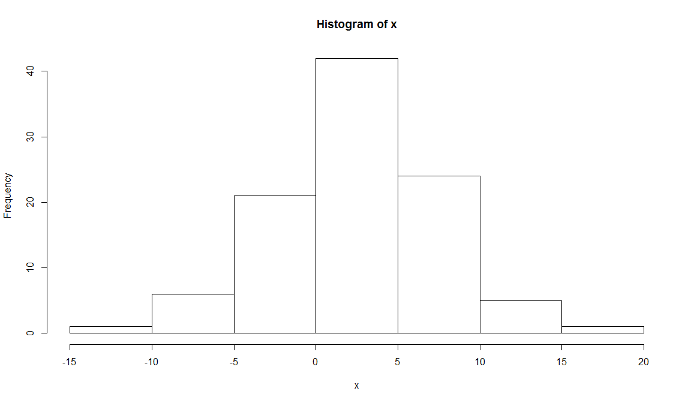

# Basic Stats
Jose Parreno Garcia  
February 2018  
<style>
body {
text-align: justify}

</style>

<br>


```r
library(knitr)
```

<br>

We will look at:

* Understanding data sampling in R
* Operating a probability distribution in R
* Working with univariate descriptive statistics in R
* Performing correlations and multivariate analysis
* Operating linear regression and multivariate analysis
* Conducting an statistical tests

# Understanding data sampling in R

There are several reasons why sampling are used:

* When using machine learning or predictive modelling, we can sample our data to create different datasets which we use to train/test/validate
* When you have a massive dataset and little computational power, you want to extract samples of the data that are representative of the wider population to model on those.


```r
# Randomnly sample a vector
sample(1:10)
```

```
##  [1]  6  9 10  1  7  5  8  2  3  4
```

```r
# Randomnly sample a vector and return X number of elements
sample(1:10, size = 5)
```

```
## [1]  9  1  2 10  7
```

```r
# Randomnly sample a vector with Bernouilli trials - ie - being able to repeat elements.
sample(c(0,1), 10, replace = TRUE)
```

```
##  [1] 0 0 1 0 1 1 0 1 1 1
```

```r
# Randomnly sample a vector that can only return integers
sample.int(20, 12)
```

```
##  [1] 10  5  1  2 19  6  3 11 15 17 14 16
```

<br>

# Operating a probability distribution in R

Remember the second point above?

* When you have a massive dataset and little computational power, you want to extract samples of the data that are representative of the wider population to model on those.


Creating different distributions:


```r
library(stats)

# Normal distribution -> returning "height" of the curve at point 0
dnorm(0)
```

```
## [1] 0.3989423
```

```r
# Idem as above, but having a mean and standard deviation
dnorm(0,mean=3,sd=5)
```

```
## [1] 0.06664492
```

```r
# Plotting a normal distribution
curve(dnorm,-3,3)
```

<!-- -->

```r
# Normal distribution -> returning the area under/left a given value
pnorm(1.5)
```

```
## [1] 0.9331928
```

```r
# Normal distribution -> returning the area above/right a given value
pnorm(1.5, lower.tail=FALSE)
```

```
## [1] 0.0668072
```

```r
# Plotting
curve(pnorm(x), -3,3)
```

<!-- -->

```r
# Normal distribution -> quantiles
qnorm(0.5)
```

```
## [1] 0
```

```r
# Generate random numbers from a normal distribution
set.seed(50)
x = rnorm(100,mean=3,sd=5)
hist(x)
```

<!-- -->

```r
# Generate random numbers from a uniform distribution
set.seed(50)
y = runif(100,0,5)
hist(y)
```

<!-- -->

## Testing normality of the data with a shapiro test


```r
# p-value is above 0.05 -> normal distribution
shapiro.test(x)
```

```
## 
## 	Shapiro-Wilk normality test
## 
## data:  x
## W = 0.99381, p-value = 0.9318
```

```r
# p-value is below 0.05 -> not a normal distribution
shapiro.test(y)
```

```
## 
## 	Shapiro-Wilk normality test
## 
## data:  y
## W = 0.95633, p-value = 0.002221
```

# Working with univariate descriptive statistics in R

We say univariate descriptive statistics because we are generating calculating for a single variable.

## Basic stats


```r
data(mtcars)

range(mtcars$mpg)
```

```
## [1] 10.4 33.9
```

```r
length(mtcars$mpg)
```

```
## [1] 32
```

```r
mean(mtcars$mpg)
```

```
## [1] 20.09062
```

```r
median(mtcars$mpg)
```

```
## [1] 19.2
```

```r
sd(mtcars$mpg)
```

```
## [1] 6.026948
```

```r
var(mtcars$mpg)
```

```
## [1] 36.3241
```

```r
sd(mtcars$mpg) ^ 2
```

```
## [1] 36.3241
```

```r
IQR(mtcars$mpg)
```

```
## [1] 7.375
```

```r
quantile(mtcars$mpg,0.67)
```

```
##  67% 
## 21.4
```

```r
max(mtcars$mpg)
```

```
## [1] 33.9
```

```r
min(mtcars$mpg)
```

```
## [1] 10.4
```

```r
cummax(mtcars$mpg)
```

```
##  [1] 21.0 21.0 22.8 22.8 22.8 22.8 22.8 24.4 24.4 24.4 24.4 24.4 24.4 24.4 24.4 24.4 24.4 32.4 32.4 33.9 33.9 33.9 33.9 33.9 33.9 33.9 33.9 33.9 33.9 33.9 33.9 33.9
```

```r
cummin(mtcars$mpg)
```

```
##  [1] 21.0 21.0 21.0 21.0 18.7 18.1 14.3 14.3 14.3 14.3 14.3 14.3 14.3 14.3 10.4 10.4 10.4 10.4 10.4 10.4 10.4 10.4 10.4 10.4 10.4 10.4 10.4 10.4 10.4 10.4 10.4 10.4
```

```r
summary(mtcars)
```

```
##       mpg             cyl             disp             hp             drat             wt             qsec             vs               am              gear            carb      
##  Min.   :10.40   Min.   :4.000   Min.   : 71.1   Min.   : 52.0   Min.   :2.760   Min.   :1.513   Min.   :14.50   Min.   :0.0000   Min.   :0.0000   Min.   :3.000   Min.   :1.000  
##  1st Qu.:15.43   1st Qu.:4.000   1st Qu.:120.8   1st Qu.: 96.5   1st Qu.:3.080   1st Qu.:2.581   1st Qu.:16.89   1st Qu.:0.0000   1st Qu.:0.0000   1st Qu.:3.000   1st Qu.:2.000  
##  Median :19.20   Median :6.000   Median :196.3   Median :123.0   Median :3.695   Median :3.325   Median :17.71   Median :0.0000   Median :0.0000   Median :4.000   Median :2.000  
##  Mean   :20.09   Mean   :6.188   Mean   :230.7   Mean   :146.7   Mean   :3.597   Mean   :3.217   Mean   :17.85   Mean   :0.4375   Mean   :0.4062   Mean   :3.688   Mean   :2.812  
##  3rd Qu.:22.80   3rd Qu.:8.000   3rd Qu.:326.0   3rd Qu.:180.0   3rd Qu.:3.920   3rd Qu.:3.610   3rd Qu.:18.90   3rd Qu.:1.0000   3rd Qu.:1.0000   3rd Qu.:4.000   3rd Qu.:4.000  
##  Max.   :33.90   Max.   :8.000   Max.   :472.0   Max.   :335.0   Max.   :4.930   Max.   :5.424   Max.   :22.90   Max.   :1.0000   Max.   :1.0000   Max.   :5.000   Max.   :8.000
```

```r
table(mtcars$cyl)
```

```
## 
##  4  6  8 
## 11  7 14
```

```r
stem(mtcars$mpg)
```

```
## 
##   The decimal point is at the |
## 
##   10 | 44
##   12 | 3
##   14 | 3702258
##   16 | 438
##   18 | 17227
##   20 | 00445
##   22 | 88
##   24 | 4
##   26 | 03
##   28 | 
##   30 | 44
##   32 | 49
```

## Basic histogram and mode


```r
library(ggplot2)

qplot(mtcars$mpg, binwidth=2)
```

<!-- -->

```r
mode = function(x) {
   temp = table(x)
   names(temp)[temp == max(temp)]
  }

x = c(1,2,3,3,3,4,4,5,5,5,6)
mode(x)
```

```
## [1] "3" "5"
```

<br>

# Performing correlations and multivariate analysis


```r
# Covariance matrix
cov(mtcars[1:3])
```

```
##              mpg        cyl       disp
## mpg    36.324103  -9.172379  -633.0972
## cyl    -9.172379   3.189516   199.6603
## disp -633.097208 199.660282 15360.7998
```

```r
# Correlation matrix
cor(mtcars[1:3])
```

```
##             mpg        cyl       disp
## mpg   1.0000000 -0.8521620 -0.8475514
## cyl  -0.8521620  1.0000000  0.9020329
## disp -0.8475514  0.9020329  1.0000000
```

```r
# Plotting heatmap
library(reshape2)
qplot(x=Var1, y=Var2, data=melt(cor(mtcars[1:3])), fill=value,
        geom="tile")
```

<!-- -->


<br>

# Operating linear regression and multivariate analysis


```r
# Create linear regression
lmfit = lm(mtcars$mpg ~ mtcars$cyl)
lmfit
```

```
## 
## Call:
## lm(formula = mtcars$mpg ~ mtcars$cyl)
## 
## Coefficients:
## (Intercept)   mtcars$cyl  
##      37.885       -2.876
```

```r
# Checking summary of the model
summary(lmfit)
```

```
## 
## Call:
## lm(formula = mtcars$mpg ~ mtcars$cyl)
## 
## Residuals:
##     Min      1Q  Median      3Q     Max 
## -4.9814 -2.1185  0.2217  1.0717  7.5186 
## 
## Coefficients:
##             Estimate Std. Error t value Pr(>|t|)    
## (Intercept)  37.8846     2.0738   18.27  < 2e-16 ***
## mtcars$cyl   -2.8758     0.3224   -8.92 6.11e-10 ***
## ---
## Signif. codes:  0 '***' 0.001 '**' 0.01 '*' 0.05 '.' 0.1 ' ' 1
## 
## Residual standard error: 3.206 on 30 degrees of freedom
## Multiple R-squared:  0.7262,	Adjusted R-squared:  0.7171 
## F-statistic: 79.56 on 1 and 30 DF,  p-value: 6.113e-10
```

```r
# Anova test of the model - analysis of the variance function
anova(lmfit)
```

```
## Analysis of Variance Table
## 
## Response: mtcars$mpg
##            Df Sum Sq Mean Sq F value    Pr(>F)    
## mtcars$cyl  1 817.71  817.71  79.561 6.113e-10 ***
## Residuals  30 308.33   10.28                      
## ---
## Signif. codes:  0 '***' 0.001 '**' 0.01 '*' 0.05 '.' 0.1 ' ' 1
```

```r
# Plotting the model
lmfit = lm(mtcars$mpg ~ mtcars$cyl)
plot(mtcars$cyl, mtcars$mpg)
abline(lmfit)
```

<!-- -->

<br>

# Conducting an statistical tests

## Binomial test


Imagine we are in a dice game, and a new player comes in with his own dice. If we expect dices to be fair, then, overall and after many plays, more or less all numbers should have appeared 1/6 of the total times. If the new player always plays to win with number 5, and we have computed he has won 92 times out of 315, we can determine if the dice he was using could be fake.


```r
binom.test(x=92, n=315, p=1/6)
```

```
## 
## 	Exact binomial test
## 
## data:  92 and 315
## number of successes = 92, number of trials = 315, p-value = 3.458e-08
## alternative hypothesis: true probability of success is not equal to 0.1666667
## 95 percent confidence interval:
##  0.2424273 0.3456598
## sample estimates:
## probability of success 
##              0.2920635
```

## Student t-test


### 1-sample t-test


```r
## ONLY COMPARING MPG

# Visualise attributes against each other - it is clear that the mean of "automobile" is different to the "overall" mean
boxplot(mtcars$mpg, mtcars$mpg[mtcars$am==0], ylab = "mpg", names=c("overall","automobile"))
abline(h=mean(mtcars$mpg),lwd=2, col="red")
abline(h=mean(mtcars$mpg[mtcars$am==0]),lwd=2, col="blue")
```

<!-- -->

```r
# Check this with a T-test
mpg.mu = mean(mtcars$mpg)
mpg_am = mtcars$mpg[mtcars$am == 0]
t.test(mpg_am,mu = mpg.mu)
```

```
## 
## 	One Sample t-test
## 
## data:  mpg_am
## t = -3.3462, df = 18, p-value = 0.003595
## alternative hypothesis: true mean is not equal to 20.09062
## 95 percent confidence interval:
##  15.29946 18.99528
## sample estimates:
## mean of x 
##  17.14737
```

### 2-sample t-test


```r
## COMPARING 2 VARIABLES

# Visualise attributes against each other - it is clear that the mean of "automobile" is different to the "manual" mean
boxplot(mtcars$mpg~mtcars$am,ylab='mpg',names=c('automatic','manual'))
abline(h=mean(mtcars$mpg[mtcars$am==0]),lwd=2, col="blue")
abline(h=mean(mtcars$mpg[mtcars$am==1]),lwd=2, col="red")
```

<!-- -->

```r
t.test(mtcars$mpg~mtcars$am)
```

```
## 
## 	Welch Two Sample t-test
## 
## data:  mtcars$mpg by mtcars$am
## t = -3.7671, df = 18.332, p-value = 0.001374
## alternative hypothesis: true difference in means is not equal to 0
## 95 percent confidence interval:
##  -11.280194  -3.209684
## sample estimates:
## mean in group 0 mean in group 1 
##        17.14737        24.39231
```

<br>

## Kolmogorov-Smirnov Test


### 1-sample KS test

Comparing a sample with a reference probability. In the case below, we generate a random distribution X, and check what the KS test decides about it.


```r
# Generate set
x = rnorm(50)

# KS test -> results show that the input is normally distributed as the p-value is bigger than 0.05 and we dont reject the null hypothesis.
ks.test(x,"pnorm")
```

```
## 
## 	One-sample Kolmogorov-Smirnov test
## 
## data:  x
## D = 0.076872, p-value = 0.9071
## alternative hypothesis: two-sided
```

### 2-sample KS test

Comparing cumulative distribution of 2 samples


```r
# Generate sample data
set.seed(3)
x = runif(n=20, min=0, max=20)
y = runif(n=20, min=0, max=20)

# Checking visually
plot(ecdf(x), do.points = FALSE, verticals=T, xlim=c(0, 20))
lines(ecdf(y), lty=3, do.points = FALSE, verticals=T)
```

<!-- -->

```r
# KS test -> do both datasets come from the same distribution? Given the p-value is bigger than 0.05, we dont reject the null hypothesis and therefore, both datasets are possibly from the same distribution.
ks.test(x,y)
```

```
## 
## 	Two-sample Kolmogorov-Smirnov test
## 
## data:  x and y
## D = 0.3, p-value = 0.3356
## alternative hypothesis: two-sided
```

## Wilcoxon Rank Sum and Signed Rank Test


```r
boxplot(mtcars$mpg~mtcars$am,ylab='mpg',names=c('automatic','manual'))
```

<!-- -->

```r
# Is the distribution of manual transmission cars the same as the distribution of automatic transmission cars? -> given that p-value is less than 0.05, we reject H0 and conclude that distributions are not the same.
wilcox.test(mpg ~ am, data=mtcars)
```

```
## Warning in wilcox.test.default(x = c(21.4, 18.7, 18.1, 14.3, 24.4, 22.8, : cannot compute exact p-value with ties
```

```
## 
## 	Wilcoxon rank sum test with continuity correction
## 
## data:  mpg by am
## W = 42, p-value = 0.001871
## alternative hypothesis: true location shift is not equal to 0
```

## Pearson chi-squared test

Determine whether the distribution of categorical variables of 2 groups differ.


```r
ftable = table(mtcars$am, mtcars$gear)
ftable
```

```
##    
##      3  4  5
##   0 15  4  0
##   1  0  8  5
```

```r
mosaicplot(ftable, main="Number of Forward Gears Within
                        Automatic and Manual Cars", color = TRUE)
```

<!-- -->

```r
# Given that p-value is less than 0.05, we reject H0, therefore we conclude the distribution of both variables is not the same
chisq.test(ftable)
```

```
## Warning in chisq.test(ftable): Chi-squared approximation may be incorrect
```

```
## 
## 	Pearson's Chi-squared test
## 
## data:  ftable
## X-squared = 20.945, df = 2, p-value = 2.831e-05
```

## ANOVA


### 1-way ANOVA


```r
boxplot(mtcars$mpg~factor(mtcars$gear),xlab='gear',ylab='mpg')
```

<!-- -->

```r
# p-value less than 0.05 -> reject H0, therefore the mean of mpg changes with different types of gears
oneway.test(mtcars$mpg~factor(mtcars$gear))
```

```
## 
## 	One-way analysis of means (not assuming equal variances)
## 
## data:  mtcars$mpg and factor(mtcars$gear)
## F = 11.285, num df = 2.0000, denom df = 9.5083, p-value = 0.003085
```

```r
# Same as above but with variance metrics
mtcars.aov = aov(mtcars$mpg ~ as.factor(mtcars$gear))
summary(mtcars.aov)
```

```
##                        Df Sum Sq Mean Sq F value   Pr(>F)    
## as.factor(mtcars$gear)  2  483.2  241.62    10.9 0.000295 ***
## Residuals              29  642.8   22.17                     
## ---
## Signif. codes:  0 '***' 0.001 '**' 0.01 '*' 0.05 '.' 0.1 ' ' 1
```

```r
# Tukey multiple comparison of means
mtcars_posthoc =TukeyHSD(mtcars.aov)
mtcars_posthoc
```

```
##   Tukey multiple comparisons of means
##     95% family-wise confidence level
## 
## Fit: aov(formula = mtcars$mpg ~ as.factor(mtcars$gear))
## 
## $`as.factor(mtcars$gear)`
##          diff        lwr       upr     p adj
## 4-3  8.426667  3.9234704 12.929863 0.0002088
## 5-3  5.273333 -0.7309284 11.277595 0.0937176
## 5-4 -3.153333 -9.3423846  3.035718 0.4295874
```

```r
# Plot shows that the differences between cars having 3 or 4 gears are the greatest because the confidence interval is furthest to the right of the plot. 
plot(mtcars_posthoc)
```

<!-- -->

### 2-way ANOVA

This is the extension of a 1-way ANOVA since the analysis covers more than 2 categorical variables rather than 1.


```r
# PLOTTING
par(mfrow=c(1,2))

# Clearly there seems to be differences between gear, transmissions and mpg
boxplot(mtcars$mpg~mtcars$gear,subset=(mtcars$am==0),xlab='gear',
        ylab = "mpg",main='automatic')

boxplot(mtcars$mpg~mtcars$gear,subset=(mtcars$am==1),xlab='gear',
        ylab = "mpg", main='manual')
```

<!-- -->

```r
# With this interaction plot, we can caracterize the relationship between variables. The resulting plot shows that the number of gears does have an effect on the mean of the mpg, but does not show a positive relationship 
interaction.plot(mtcars$gear, mtcars$am, mtcars$mpg, type="b",
                 col=c(1:3),leg.bty="o", leg.bg="beige", lwd=2, pch=c(18,24,22),
                 xlab="Number of Gears", ylab="Mean Miles Per Gallon",
                 main="Interaction Plot")

# 2-ways anova on MPG with combination of the other factors -> output shows that the p-value of the gear is lower than 0.05, therefore cars with different number of gears are more likely to have different means of mpg
mpg_anova2 = aov(mtcars$mpg~factor(mtcars$gear)*factor(mtcars$am))
summary(mpg_anova2)
```

```
##                     Df Sum Sq Mean Sq F value   Pr(>F)    
## factor(mtcars$gear)  2  483.2  241.62  11.869 0.000185 ***
## factor(mtcars$am)    1   72.8   72.80   3.576 0.069001 .  
## Residuals           28  570.0   20.36                     
## ---
## Signif. codes:  0 '***' 0.001 '**' 0.01 '*' 0.05 '.' 0.1 ' ' 1
```

```r
TukeyHSD(mpg_anova2)
```

```
##   Tukey multiple comparisons of means
##     95% family-wise confidence level
## 
## Fit: aov(formula = mtcars$mpg ~ factor(mtcars$gear) * factor(mtcars$am))
## 
## $`factor(mtcars$gear)`
##          diff        lwr       upr     p adj
## 4-3  8.426667  4.1028616 12.750472 0.0001301
## 5-3  5.273333 -0.4917401 11.038407 0.0779791
## 5-4 -3.153333 -9.0958350  2.789168 0.3999532
## 
## $`factor(mtcars$am)`
##         diff       lwr     upr     p adj
## 1-0 1.805128 -1.521483 5.13174 0.2757926
```

```r
par(mfrow=c(1,2))
```

<!-- -->

```r
plot(TukeyHSD(mpg_anova2))
```

<!-- -->


